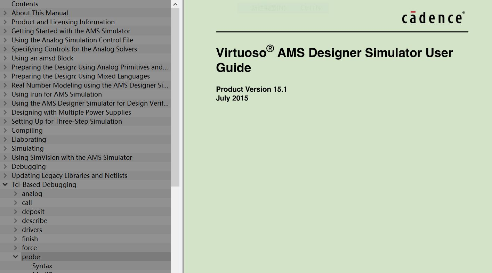

# memristor based BAM Neural Network Implemented by Verilog-AMS 

## Overview
-----------------------------------------------
<!--project purpose--> 
This project is aim at the system level
design of memristor-based BAM neural network circuits when both digital and analog circuits are employed. 
<!--brief illustration of Verilog-AMS-->
Verilog-AMS is a hardware description language which is an extension of Verilog capable of design digital, analog and mix-signal circuits 
<!--brief illustration of Cadence virtuoso,spectre and AMS designer -->
The feature of Verilog-AMS laguage can be supported by the Candece ltd.co product Virtuoso platform with related sub-product module installed on this platform, namely, the Spetre simulator for analog IC, Incisive for digital circuit, the mixed mode simulator product MMSIM 
For illustration purpose, if we make an analogy, virtuoso is to Powerpoint and ams is to MathType 

## Dependency
-----------------------------------------------
* Virtuoso Platform must be installed, the version is asked for IC617 or higher,
* INCISIVE  coupled with the AMS designer installed. the detailed product ID for run Verilog-AMS is INCISIVE151 MMSIM151
* MMSIM  MMSIM is short for Multi-Mode Simulation 

## Sample Code Illustration of Verilog-AMS Design
-----------------------------------------------
### Voltage Source 
    some voltage souce like pulse voltage is important such as serve as the clock signal for digital JK or SR registor or can be instantiated  

### Device instantiation 
passitive device like resistor, capacitor, and active device like MOS transistors can be instantiated by the spectre

 
### Dataset pattern generation
The train and test dataset is converted to voltage signal during simulation via the GenXsrc/GenYsc module For more details about Verilog-AMS language, please refer to "Cadence Verilog-AMS User Manual

each pattern in the dataset file is a binary digit list like the figure below
## Geting Start
-----------------------------------------------
### Directory structure of the Verilog-AMS source file
The Verilog-AMS code of Each circuit unit is in related folder, and the foled named "top_module" is the overall top modul that use other circuits

### Set up spectre control file
<!--usage -->

The spectre control file is used to set up corresponding simulation option. 
<!--Reference -->
For detail setup information, Virtuoso Spectre Circuit Simulator Reference
<!--file name -->
The control file is entitled amsControlSpectre.scs 

<!--case illustration -->
Here we just show a simple case listed in the control file as we want the simulator do transient analysis
for a time length of 

### Run the simulation script
<!--Usage -->
You can run it either by the Cadence GUI (Graphic User Interface) or by the sh script in linux terminal.  

<!--Reference -->
The details of seting the shell script of irun, please refer to 
<!--file name -->
the file is entitled with "sim.sh"
<!--one case illustration -->

### Set up probe for visualizing signal 
<!--usage -->

<!--Reference -->
For more detailed information, please check the file ofVirtuoso AMS Designer Simulator User Guide  
<!--file name -->
The file seting up probe is entitled "inputprobe.tcl", which is generated by the python script entitled "genprobe.py"
<!--one case illustration -->
For more details about AMS designer simulation, please refer to 

### Scalability
to change the scalability of the BAM neural network, you just simply change the related definition of macro xNum/yNum, For example, in the top.vams file, you can change 24 to a large scale to 96 as shown in the figure below.( 
Note that other scale also need be altered such as the test pattern dimention).

 

## License
-----------------------------------------------------
This project is released under the Open Source License of BSD.

