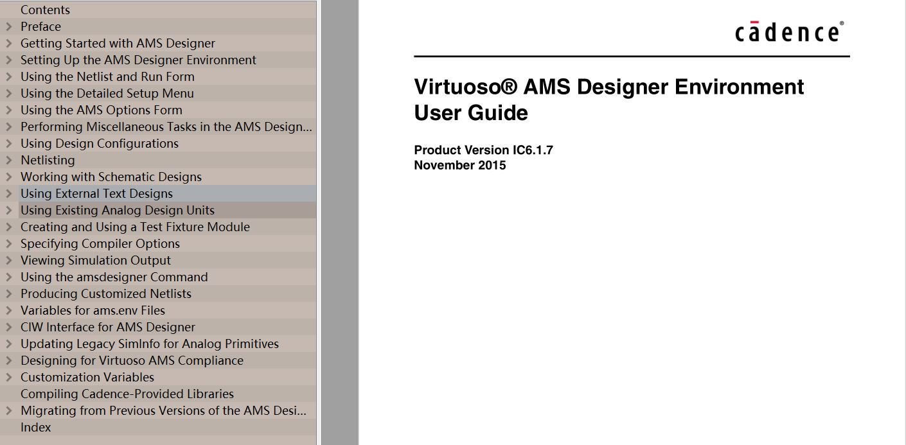
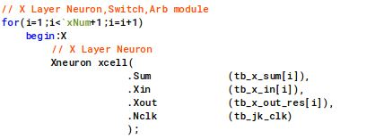

# memristor based BAM Neural Network Implemented by Verilog-AMS 

## Overview
-----------------------------------------------
<!--project purpose--> 
This project aims to design memristor-based BAM neural network circuits using Verilog-AMS.  
<!--brief illustration of Verilog-AMS-->
Verilog-AMS is a hardware description language, which is capable of designing digital, analog and mix-signal circuits. 
<!--brief illustration of Cadence virtuoso,spectre and AMS designer -->
Such feature of Verilog-AMS language is fully supported by the Cadence Virtuoso platform with related sub-product module installed on this platform. Namely, the AMS Designer product suite that is composed of Incisive for digital circuit simulation and verification, Spectre for analog circuit simulation and the mixed mode simulator product MMSIM.
There are more detailed introductions about AMS designer product suite in the Cadence pdf file reference of AMS Simulator User Guide shown in the figure below. 

## Dependency
-----------------------------------------------
In order to use AMS designer suite, below Cadence product unit is recommended to be installed.
* Virtuoso:  The version is recommended to be IC617 or higher,
* INCISIVE:  The version is recommended to be INCISIVE151 or higher
* MMSIM:  The version is recommended to be MMSIM151 or higher

For beginers to better understand the Cadence product, let's draw such an analogy. Cadence Virtuoso platform is sort of like the Windows operating system. Virtuoso AMS designer suite is kind of similar to the Office2016 suite, and the INCISIVE151 or MMSIM151 is like the detailed product Word2016 or Excel2016.

## Geting Start
-----------------------------------------------
### Directory structure of the Verilog-AMS source file
The Verilog-AMS code of each circuit module is in folder with coresponding name, and the folder named "top\_module" is top test bench module that contain both stimuli and the full design of the memristive BAM circuits.

### Set up spectre control file
<!--usage -->
The spectre control file is used to set up corresponding analog circuit simulation option. 
<!--Reference -->
For detailed information, please refer to the Virtuoso Spectre Circuit Simulator Reference.

<!--file name -->
The control file in this project is entitled amsControlSpectre.scs 
<!--case illustration -->
Here we just extract a simple case of doing the tran analysis in the control file which set up the tran simulation for a time of 3412 us 

### Run the simulation script
<!--Usage -->
You can run simulation of the design either by the Cadence GUI (Graphic User Interface) mode or by the shell script mode in linux terminal. The shell mode in linux is adopted in this project. The Virtuoso AMS Designer provide the command line instructions irun with several arguments options.   
<!--Reference -->
The details of seting the shell script of irun, please refer to related section of Virtuoso AMS Designer Simulator User Guide.

<!--file name -->
The shell script for simulation is entitled with "sim.sh", so we just type "shell sim.sh" in Linux terminal to run simulation. Note that related directory maybe changed in your environment.
<!--one case illustration -->

### Set up probe for visualizing signal 
<!--usage -->
The simulation result can be saved in different format. A "probe" file need to be specified that which current or voltage of the related circuit module need to be saved for visualizing. 
<!--Reference -->
For more detailed syntax of seting the probe, please check related section in Virtuoso AMS Designer Simulator User Guide. 
 
<!--file name -->
The file setting up probes in this project is entitled "inputprobe.tcl", which is generated by the python script entitled "genprobe.py"
<!--one case illustration -->
Take the below sample case, it sets probes to measure the voltage of wire tb\_en\_lu\_y and tb\_y\_in in the design module Top\_Recall\_Only (For beginer to better understand, the wire tb\_y\_in is like a vector datatype. tb\_y\_in[16] represents the 16th item). 

### Scalability
The scalability of the memristive BAM neural network can be alterd simply by changing the related definition of the macro xNum/yNum, For example, in the top.vams file, you can change 24 to a large scale of 96 as shown in the figure below. (Note that other scale also need be altered such as the test pattern dimention).

 

## Sample Code Illustration of Using Verilog-AMS Design
-----------------------------------------------
### Voltage Source 
some voltage souce like pulse voltage is important such as serve as the clock signal for digital JK or SR registor or can be instantiated  

### Device instantiation 
Passitive device such as resistor, capacitor, and active device like MOS transistors can be instantiated compatible to Spectre/Spice. Below case shows the instantiation of a resistor

### Statement for massive device instantiation
Verilog-AMS is very suitable for massive device instantiation compared to SPICE by using "for" loop syntax. 
Let's take an example. As to a JK flipflop based BAM neuron, the schematic is shown in the below figure.

If we want instantiate the BAM neuron of X layer, "for" loop is used like this

  
### Dataset pattern generation
The train and test dataset is converted to voltage signal during simulation via the GenXsrc/GenYsc module in this project and each pattern in the dataset file is a binary digit. 

For more details about Verilog-AMS language usage, please refer to Cadence Verilog-AMS Language Reference.

## License
-----------------------------------------------------
This project is released under the Open Source License of BSD.

